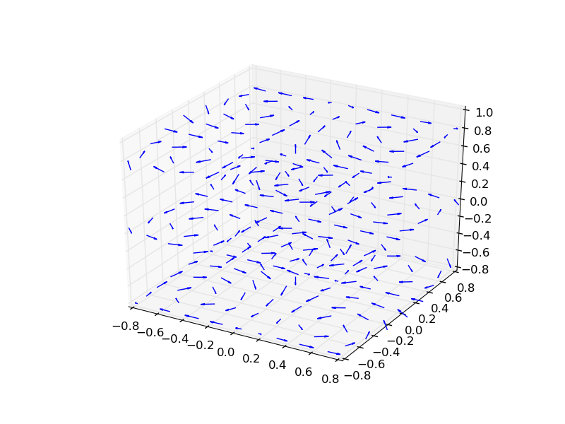

```{r setup, include=FALSE}
# this prevents package loading message from appearing in the rendered version of your problem set
knitr::opts_chunk$set(warning = FALSE, message = FALSE)

# loading required packages
library(tidyverse)
library(openintro)
library(descriptr)
library(assertable)
library(gapminder)
library(ggridges)
library(stringr)
library(patchwork)


library(gcookbook)
```

# A Tutorial for Vector Fields in R

## Getting Started with Vector Fields

In this tutorial, we'll explain the basic components of a vector field graph
using the. Vector field graphs have a number of important
applications such as ('PLACEHOLDER').

From our research, the documentation available could use improvement, and thus our 
goal is provide an accessible explanation of how to build such graphs in R. To 
keep things clear, we'll build an example data set as we go, explaining all of 
the required components of a vector field graph. Hopefully, after reading this
tutorial, you'll be able to easily identify the required components for vector
graphs in future data sets.

In our example data set, each observation represents one arrow, or vector, to be 
plotted on our graph. As vectors communicate movement, each arrow will have a
starting point and an end point. Before we dive in, we've listed below the four 
data columns required for building a vector graph, each of which we will build 
in our example data set.

- x_axis: horizontal value of the starting point for a given vector
- y_axis: vertical value of the starting point for a given vector
- x_pull: strength of force pulling vector in horizontal direction
- y_pull: strength of force pulling vector in vertical direction 

First, we will require two data columns serving as x and y coordinates for 
placement of the arrow on the graph. These initial coordinates, which we 
will call x_axis and y_axis, will place the base of each arrow on the vector 
graphs. Stated otherwise, together the x_axis and y_axis columns provide the 
starting point for each arrow on the graph.

In the code below, we start building our example data set by placing the base
of each vector on all positive integer values of a 10 X 10 grid, by assigning 
values to the x_axis and y_axis columns. 

```{r}
# EF: creating a blank data frame with four required columns
data_frame = data.frame(x_axis = numeric(), y_axis = numeric())

# EF: generating evenly distributed values for x y coordinates
for(i in 1:10) {
  for(j in 1:10) {
    vec <- c(i, j) 
    data_frame[nrow(data_frame) + 1, ] <- vec
  }
}

# EF: plotting points for illustrative purposes
ggplot(data_frame, aes(x = x_axis, y = y_axis)) +
    scale_x_continuous(breaks = seq(0,10,1)) + 
    scale_y_continuous(breaks = seq(0,10,1)) +
    geom_segment(aes(xend = x_axis+(0.05), yend = y_axis))
```
In graphing the plot, we've assigned x_axis and y_axis values as the axis values
of the entire chart, again, as the columns place each arrow. The geom_segment
function plots the lines, we've added an endpoint of 0.05 to the x_axis so that
the base of each vector can be seen above.

After plotting the starting points of all vectors, we now need to
determine where all of our vectors will end. This will be determined by 
the x_pull and y_pull columns. It's important to note that these columns
will not provide the end coordinates, but a measure of the directions in which 
each vector is pulled. The x_pull and y_pull variables will indicate how far 
from the base the arrow should extend in the given direction.

You'll notice in the code below, the x_pull and y_pull values are being added
to the starting point values (x_axis & y_axis) in the geom_segment function. 
The variables within aes which dictate the end points of a vector are conveniently 
named 'xend' and 'yend'. By altering the 'xend' and 'yend' values, we place
the coordinates of a vectors endpoint.

For example, if I set only the y_pull equal to 0.5, you'll notice that all of the 
arrows are being pulled in an upward direction.

```{r}
data_frame$x_pull <- 0
data_frame$y_pull <- 0.5

# EF: plotting points for illustrative purposes
ggplot(data_frame, aes(x = x_axis, y = y_axis)) +
    scale_x_continuous(breaks = seq(0,10,1)) + 
    scale_y_continuous(breaks = seq(0,10,1)) +
    geom_segment(aes(xend = x_axis + (x_pull), 
                     yend = y_axis + (y_pull)), 
                 arrow = arrow(length = unit(0.1, "cm")), size = 0.25)
```
Conversely, if I set only the x_pull equal to 0.5, you'll notice that all of the 
arrows are being pulled to the right direction.

```{r}
data_frame$x_pull <- 0.5
data_frame$y_pull <- 0

# EF: plotting points for illustrative purposes
ggplot(data_frame, aes(x = x_axis, y = y_axis)) +
    scale_x_continuous(breaks = seq(0,10,1)) + 
    scale_y_continuous(breaks = seq(0,10,1)) +
    geom_segment(aes(xend = x_axis + (x_pull), 
                     yend = y_axis + (y_pull)), 
                 arrow = arrow(length = unit(0.1, "cm")), size = 0.25)
```
Lastly, if we set both x_pull and y_pull equal to 0.5, then the x and y forces are
offsetting, and the arrows point in a 45 degree angle. 

```{r}
data_frame$x_pull <- 0.5
data_frame$y_pull <- 0.5

ggplot(data_frame, aes(x = x_axis, y = y_axis)) +
    scale_x_continuous(breaks = seq(0,10,1)) + 
    scale_y_continuous(breaks = seq(0,10,1)) +
    geom_segment(aes(xend = x_axis + (x_pull), 
                     yend = y_axis + (y_pull)), 
                     arrow = arrow(length = unit(0.1, "cm")), size = 0.25)
```

Lastly, we've input random numbers into x_pull and y_pull values, to show that 
the format is completely flexible and doesn't require consistent value changes
to the x_pull and y_pull variables.

```{r}
data_frame$x_pull <- runif(nrow(data_frame), min=-0.5, max=0.5)
data_frame$y_pull <- runif(nrow(data_frame), min=-0.5, max=0.5)

ggplot(data_frame, aes(x = x_axis, y = y_axis)) +
    scale_x_continuous(breaks = seq(0,10,1)) + 
    scale_y_continuous(breaks = seq(0,10,1)) +
    geom_segment(aes(xend = x_axis + (x_pull), 
                     yend = y_axis + (y_pull)), 
                     arrow = arrow(length = unit(0.1, "cm")), size = 0.25)
```


##Tips and Tricks to Plotting Vector Fields

Now that we've covered the basics, we will share some advice on how to plot 
high-quality vector fields. 

###Arrow Length
It is important to consider the length of arrows when plotting vector fields because
if arrows are too long, they will overlap and make the plot difficult to interpret 
(see example below).

```{r}
data_frame$x_pull <- 5
data_frame$y_pull <- 1

# SS: plotting points for illustrative purposes
ggplot(data_frame, aes(x = x_axis, y = y_axis)) +
    scale_x_continuous(breaks = seq(0,10,1)) + 
    scale_y_continuous(breaks = seq(0,10,1)) +
    geom_segment(aes(xend = x_axis + (x_pull), 
                     yend = y_axis + (y_pull)), 
                 arrow = arrow(length = unit(0.1, "cm")), size = 0.25)
```

As you can see, even with this fairly simple plot that has all vectors pointing
x+5 and y+1, it appears messy and difficult to interpret due to overlapping arrows.
Therefore, we recommend scaling down the x_pull and y_pull vectors, to avoid overlap, 
as shown below (note it is good practice to scale the x_pull and y_pull by the same
amount)

```{r}
# Assume this is the raw x_pull & y_pull data
data_frame$x_pull <- 5
data_frame$y_pull <- 1

#Scale vector data
data_frame$x_pull <- data_frame$x_pull / 10
data_frame$y_pull <- data_frame$y_pull / 10

# SS: plotting points for illustrative purposes
ggplot(data_frame, aes(x = x_axis, y = y_axis)) +
    scale_x_continuous(breaks = seq(0,10,1)) + 
    scale_y_continuous(breaks = seq(0,10,1)) +
    geom_segment(aes(xend = x_axis + (x_pull), 
                     yend = y_axis + (y_pull)), 
                 arrow = arrow(length = unit(0.1, "cm")), size = 0.25)
```


###Arrow Color
As you may have noticed, when scaling down the arrows, the absolute length of the 
arrows loses meaning and the relative length of an arrow compared to others in the
vector field becomes the area of emphasis. While this qualitative representation 
is acceptable in most cases of plotting vector fields, it is possible to add color
to arrows based on their magnitude - see below. Moreover, above the colorbar we can 
add a title explaining the units that the colors represent (eg m/s).


```{r}
vector_frame = data.frame(x_axis = numeric(), y_axis = numeric())

# EF: generating evenly distributed values for x y coordinates
for(i in -10:10) {
  for(j in -10:10) {
    vec <- c(i, j) 
    vector_frame[nrow(vector_frame) + 1, ] <- vec
  }
}

vector_frame$x_pull <- with(vector_frame, -x_axis/(sqrt((x_axis^2) + (y_axis^2)) + 4))
vector_frame$y_pull <- with(vector_frame, 2*y_axis/(sqrt((x_axis^2) + (y_axis^2)) + 4))
vector_frame$mag    <- sqrt( (vector_frame$x_pull^2) + (vector_frame$y_pull)^2 ) 

ggplot(vector_frame, aes(x = x_axis, y = y_axis, colour=mag) )+
    scale_colour_continuous(name = "Choose units") +
    scale_x_continuous(breaks = seq(-10,10,1)) + 
    scale_y_continuous(breaks = seq(-10,10,1)) +
    geom_segment(aes(xend = x_axis + (x_pull), 
                     yend = y_axis + (y_pull)), 
                     arrow = arrow(length = unit(0.1, "cm")), size = 0.25) +
    geom_vline(xintercept=0, size=0.15) + geom_hline(yintercept=0, size=0.15)
```

In the following plot, we have changed the arrow color to be based of x_pull value,
rather than magnitude. This could be useful if the flow in one direction is more 
important than the other. 

```{r}
vector_frame = data.frame(x_axis = numeric(), y_axis = numeric())

# EF: generating evenly distributed values for x y coordinates
for(i in -10:10) {
  for(j in -10:10) {
    vec <- c(i, j) 
    vector_frame[nrow(vector_frame) + 1, ] <- vec
  }
}

vector_frame$x_pull <- with(vector_frame, -x_axis/(sqrt((x_axis^2) + (y_axis^2)) + 4))
vector_frame$y_pull <- with(vector_frame, 2*y_axis/(sqrt((x_axis^2) + (y_axis^2)) + 4))

ggplot(vector_frame, aes(x = x_axis, y = y_axis, colour=x_pull) )+
    scale_colour_continuous(low = "dodgerblue", high = "darkred") +
    scale_x_continuous(breaks = seq(-10,10,1)) + 
    scale_y_continuous(breaks = seq(-10,10,1)) +
    geom_segment(aes(xend = x_axis + (x_pull), 
                     yend = y_axis + (y_pull)), 
                     arrow = arrow(length = unit(0.1, "cm")), size = 0.25) +
    geom_vline(xintercept=0, size=0.15) + geom_hline(yintercept=0, size=0.15)
```


###Spacing

Vector fields often describe flows in the continuous space, which means there could
be an infinite number of vectors in the plot. To overcome this, we usually sample
uniformly spaced points in the field and plot their vectors. Choosing the point 
spacing is important because if we down-sample too much we lose information and if
don't down-sample enough the vector field becomes cluttered.

```{r}
vector_frame1 = data.frame(x_axis = numeric(), y_axis = numeric())

# SS: generating evenly distributed values for x y coordinates
for(i in seq(-10, 10, by=0.4)) {
  for(j in seq(-10, 10, by=0.4)) {
    vec <- c(i, j) 
    vector_frame1[nrow(vector_frame1) + 1, ] <- vec
  }
}

vector_frame1$x_pull <- with(vector_frame1, -x_axis/(sqrt((x_axis^2) + (y_axis^2)) + 4))
vector_frame1$y_pull <- with(vector_frame1, 2*y_axis/(sqrt((x_axis^2) + (y_axis^2)) + 4))

p1 <- ggplot(vector_frame1, aes(x = x_axis, y = y_axis) )+
        scale_x_continuous(breaks = seq(-10,10)) + 
        scale_y_continuous(breaks = seq(-10,10)) +
        geom_segment(aes(xend = x_axis + (x_pull), 
                         yend = y_axis + (y_pull)), 
                         arrow = arrow(length = unit(0.1, "cm")), size = 0.25) +
        geom_vline(xintercept=0, size=0.15) + geom_hline(yintercept=0, size=0.15) +
        ggtitle("Vector Field with not enough spacing")


vector_frame2 = data.frame(x_axis = numeric(), y_axis = numeric())

# SS: generating evenly distributed values for x y coordinates
for(i in seq(-10, 10, by=5)) {
  for(j in seq(-10, 10, by=5)) {
    vec <- c(i, j) 
    vector_frame2[nrow(vector_frame2) + 1, ] <- vec
  }
}

vector_frame2$x_pull <- with(vector_frame2, -x_axis/(sqrt((x_axis^2) + (y_axis^2)) + 4))
vector_frame2$y_pull <- with(vector_frame2, 2*y_axis/(sqrt((x_axis^2) + (y_axis^2)) + 4))

p2 <- ggplot(vector_frame2, aes(x = x_axis, y = y_axis) )+
        scale_x_continuous(breaks = seq(-10,10)) + 
        scale_y_continuous(breaks = seq(-10,10)) +
        geom_segment(aes(xend = x_axis + (x_pull), 
                         yend = y_axis + (y_pull)), 
                         arrow = arrow(length = unit(0.1, "cm")), size = 0.25) +
        geom_vline(xintercept=0, size=0.15) + geom_hline(yintercept=0, size=0.15) +
        ggtitle("Vector Field with too much spacing")

p1 + p2


    
```

As shown above, at the extremes of spacing, vector fields are difficult to interpret.
Hence, there must be an optimal spacing between the too. As illustrated below, this 
optimal spacing also depends on arrow length because closer spacing require shorter
arrow lengths and larger spacings allow longer arrow lengths. In other words, there
is a trade-off between vector spacing and vector length.

```{r}
vector_frame1 = data.frame(x_axis = numeric(), y_axis = numeric())

# SS: generating evenly distributed values for x y coordinates
for(i in seq(-10, 10, by=2)) {
  for(j in seq(-10, 10, by=2)) {
    vec <- c(i, j) 
    vector_frame1[nrow(vector_frame1) + 1, ] <- vec
  }
}

vector_frame1$x_pull <- with(vector_frame1, -2*x_axis/(sqrt((x_axis^2) + (y_axis^2)) + 4))
vector_frame1$y_pull <- with(vector_frame1, 3*y_axis/(sqrt((x_axis^2) + (y_axis^2)) + 4))

p1 <- ggplot(vector_frame1, aes(x = x_axis, y = y_axis) )+
        scale_x_continuous(breaks = seq(-10,10)) + 
        scale_y_continuous(breaks = seq(-10,10)) +
        geom_segment(aes(xend = x_axis + (x_pull), 
                         yend = y_axis + (y_pull)), 
                         arrow = arrow(length = unit(0.1, "cm")), size = 0.25) +
        geom_vline(xintercept=0, size=0.15) + geom_hline(yintercept=0, size=0.15) +
        ggtitle("Opitmal Vector Field with more spacing")


vector_frame2 = data.frame(x_axis = numeric(), y_axis = numeric())

# SS: generating evenly distributed values for x y coordinates
for(i in seq(-10, 10, by=1)) {
  for(j in seq(-10, 10, by=1)) {
    vec <- c(i, j) 
    vector_frame2[nrow(vector_frame2) + 1, ] <- vec
  }
}

vector_frame2$x_pull <- with(vector_frame2, -x_axis/(sqrt((x_axis^2) + (y_axis^2)) + 4))
vector_frame2$y_pull <- with(vector_frame2, y_axis/(sqrt((x_axis^2) + (y_axis^2)) + 4))

p2 <- ggplot(vector_frame2, aes(x = x_axis, y = y_axis) )+
        scale_x_continuous(breaks = seq(-10,10)) + 
        scale_y_continuous(breaks = seq(-10,10)) +
        geom_segment(aes(xend = x_axis + (x_pull), 
                         yend = y_axis + (y_pull)), 
                         arrow = arrow(length = unit(0.1, "cm")), size = 0.25) +
        geom_vline(xintercept=0, size=0.15) + geom_hline(yintercept=0, size=0.15) +
        ggtitle("Optimal Vector Field with less spacing")

p1 + p2

```


###Dealing with 3D

So far we have looked at vector fields in 2 dimensions. However, it is common to 
for vector fields to have 3 dimensions. While it is tempting to try to 3D plots for
these vector fields, we strongly recommend against this as they are confusing. As
shown in the plot below which had been taken from [this page](https://stackoverflow.com/questions/7130474/3d-vector-field-in-matplotlib)



Therefore, the first thing we recommend you to consider when plotting 3D vector
fields is: *Do I actually need to plot in 3 dimensions?*

In some cases one dimension may have a small contribution to the overall flow. 
You could check this by comparing contributions of each direction to the magnitude
of each vector using the following formulas x^2/ (x^2+y^2+z^2) , y^2/ (x^2+y^2+z^2)
& z^2/ (x^2+y^2+z^2).

Another aspect to consider is the symmetry in the environment of the flow.....


##Application

###Flow

###Stability Analysis

###Extra

An important note, different data sets may require different scaling.
One may have to divide the x_pull and y_pull fields in order for the lines to
fit clearly on the graph. One must ensure that the scale of the x_pull and y_pull
fields is smaller than the x_axis and y_axis fields, or else the arrows will overlap.

Now that we've covered the basics, let's show how we can customize vector field
graphs. For this example, I'll create a new data set with x_axis and y_axis values
ranging from -10 to 10.
